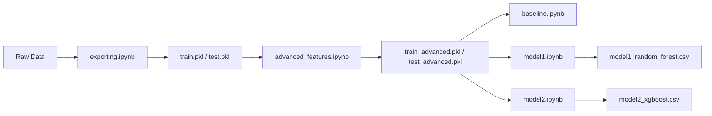

# Machine Learning - TP3

## Estructura de Archivos

```
machine_learning/
├── ml_utils.py                    # Utilidades comunes (evaluación, visualización)
├── advanced_features.ipynb        # Feature engineering avanzado
├── baseline.ipynb                 # Modelos baseline (Random + Logistic Regression)
├── model1.ipynb                   # Random Forest con GridSearchCV
└── model2.ipynb                   # XGBoost con GridSearchCV y Mean Encoding
```

## Notebooks

### 1. `advanced_features.ipynb` - Feature Engineering Avanzado

**Features Creadas:**
- **Análisis de sentimiento** (TextBlob):
  - `sentiment_polarity`: -1 (negativo) a +1 (positivo)
  - `sentiment_subjectivity`: 0 (objetivo) a 1 (subjetivo)

- **Features lingüísticas**:
  - `emoji_count`: Número de emojis
  - `uppercase_word_count`: Palabras en mayúsculas (gritos)
  - `lexical_diversity`: Ratio de palabras únicas
  - `number_count`: Cantidad de números

- **Geocodificación**:
  - `location_lat`, `location_lon`: Coordenadas geográficas
  - `has_valid_location`: Feature binaria

- **Intensidad de emergencia**:
  - `urgency_word_count`: Palabras de urgencia (help, emergency, etc.)
  - `intensity_word_count`: Palabras de intensidad (devastating, fatal, etc.)

**Total**: 11 features adicionales

**Salida**: `train_advanced.pkl`, `test_advanced.pkl`

---

### 2. `baseline.ipynb` - Modelos Baseline

**Objetivo**: Establecer línea base de performance

**Modelos:**
1. **Random Classifier** (DummyClassifier)
   - Predicción aleatoria estratificada
   - F1 esperado ≈ p (proporción de clase positiva)
   - Sirve para entender el piso de performance

2. **Regresión Logística**
   - Modelo lineal simple
   - `class_weight='balanced'`
   - Features: 7 numéricas + TF-IDF (50) + OneHot keywords (50)

**Features utilizadas:**
- 7 numéricas básicas
- 50 TF-IDF del texto lematizado
- 50 OneHot encoding de keywords

**Total**: ~107 features

---

### 3. `model1.ipynb` - Random Forest con GridSearchCV

**Algoritmo**: Random Forest Classifier

**Features utilizadas:**
- 7 numéricas básicas
- 9 numéricas avanzadas (sentiment, linguistic, intensity)
- 2 location (lat, lon)
- 100 TF-IDF (texto + bigrams)
- ~100 OneHot keywords

**Total**: ~218 features

**GridSearchCV:**
- Parámetros: `n_estimators`, `max_depth`, `min_samples_split`, `min_samples_leaf`, `max_features`, `class_weight`
- CV: 5-fold cross-validation
- Scoring: F1 Score

**Target**: F1 > 0.80 en validación

**Salida**: `model1_random_forest.csv` (submissions)

---

### 4. `model2.ipynb` - XGBoost con GridSearchCV y Mean Encoding

**Algoritmo**: XGBoost Classifier (Gradient Boosting)

**Diferencias clave con Model 1:**
- Usa **XGBoost** en vez de Random Forest
- Usa **Mean Encoding** para keywords en vez de OneHot
  - Reduce dimensionalidad (1 columna vs ~100)
  - Captura relación directa con target
- Más features TF-IDF (150 vs 100)

**Features utilizadas:**
- 7 numéricas básicas
- 9 numéricas avanzadas
- 2 location (lat, lon)
- 150 TF-IDF (texto + bigrams)
- 1 mean encoding de keywords

**Total**: 169 features

**GridSearchCV:**
- Parámetros: `n_estimators`, `max_depth`, `learning_rate`, `subsample`, `colsample_bytree`, `gamma`, `reg_alpha`, `reg_lambda`
- CV: 5-fold cross-validation
- Scoring: F1 Score

**Target**: F1 > 0.80 en validación

**Salida**: `model2_xgboost.csv` (submissions)

---

## ml_utils.py - Utilidades Comunes

Módulo Python reutilizable con funciones para:

### `evaluate_model(y_true, y_pred, model_name, print_results=True)`
Evalúa un modelo y muestra:
- F1 Score ⭐ (métrica principal)
- Accuracy, Precision, Recall
- Matriz de confusión (heatmap)
- Classification report

### `plot_feature_importance(feature_names, importance_values, model_name, top_n=20)`
Grafica importancia de features:
- Barras horizontales
- Colores por signo (rojo = positivo, azul = negativo)
- Top N más importantes

### `compare_models(results_dict)`
Compara múltiples modelos en una tabla:
- F1, Accuracy, Precision, Recall
- Identifica mejor modelo por F1

---

## Flujo de Trabajo



---

## Ejecución

### 1. Feature Engineering Avanzado (PRIMERO)
```bash
jupyter notebook advanced_features.ipynb
```
Ejecutar todas las celdas. Esto creará `train_advanced.pkl` y `test_advanced.pkl`.

### 2. Baseline (Opcional)
```bash
jupyter notebook baseline.ipynb
```

### 3. Model 1 - Random Forest
```bash
jupyter notebook model1.ipynb
```
⚠️ **GridSearchCV puede tomar 10-30 minutos**

### 4. Model 2 - XGBoost
```bash
jupyter notebook model2.ipynb
```
⚠️ **GridSearchCV puede tomar 15-45 minutos**

---

## Requisitos

### Paquetes Python
```bash
pip install pandas numpy scikit-learn xgboost textblob matplotlib seaborn tqdm
```

### Descargar modelo de TextBlob
```bash
python -m textblob.download_corpora
```

---

## Comparación de Modelos

| Modelo | Algoritmo | Encoding Keywords | Features | GridSearchCV | Target F1 |
|--------|-----------|-------------------|----------|--------------|-----------|
| Baseline (Random) | DummyClassifier | - | - | No | ≈ p |
| Baseline (Logistic) | Logistic Regression | OneHot (50) | 107 | No | - |
| **Model 1** | Random Forest | OneHot (100) | 218 | ✅ | > 0.80 |
| **Model 2** | XGBoost | Mean Encoding | 169 | ✅ | > 0.80 |

---

## Estrategias Clave

### Feature Engineering
1. **Sentiment Analysis**: Captura polaridad emocional de tweets
2. **Geocoding**: Convierte locations en coordenadas
3. **Urgency Words**: Detecta palabras de emergencia
4. **Lexical Diversity**: Mide riqueza del vocabulario
5. **Bigrams**: Captura contexto de palabras adyacentes

### Encoding
- **OneHot**: Bueno para Random Forest (captura interacciones no lineales)
- **Mean Encoding**: Mejor para XGBoost (reduce dimensionalidad, captura target directo)

### Hiperparámetros
- **GridSearchCV**: Búsqueda exhaustiva con 5-fold CV
- **F1 Score**: Métrica de optimización (balance precision/recall)
- **class_weight='balanced'**: Maneja desbalance de clases

### Validación
- **80/20 split** estratificado
- **Análisis de overfitting**: Comparar train vs validation
- **Feature importance**: Entender qué features importan

---

## Notas

- **Reproducibilidad**: Todas las seeds fijadas en `RANDOM_STATE=42`
- **Data Leakage**: Mean encoding solo usa train set
- **Scaling**: StandardScaler para features numéricas (importante para XGBoost)
- **Missing Values**: Locations missing → -999 (valor especial)
- **Text Processing**: Lematización con spacy + TF-IDF
